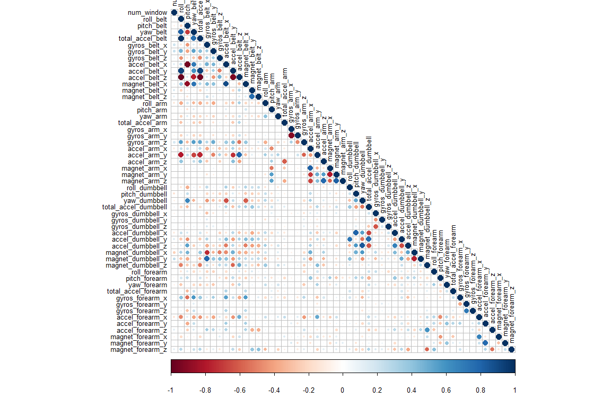
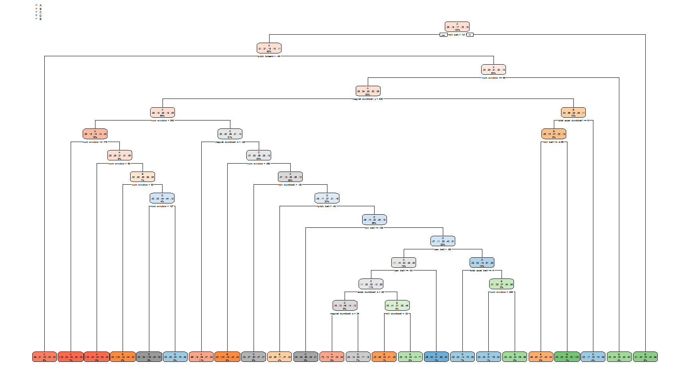

## Overview

Using devices such as Jawbone Up, Nike FuelBand, and Fitbit, it is now possible to collect a large amount of data about personal activity relatively inexpensively. The aim of this project is to predict the manner in which participants perform a barbell lift. The data comes from http://groupware.les.inf.puc-rio.br/har wherein 6 participants were asked to perform the same set of exercises correctly and incorrectly with accelerometers placed on the belt, forearm, arm, and dumbell.  

The following steps are followed:

1. Data Preprocessing
2. Exploratory Analysis
3. Prediction Model Selection
4. Predicting Test Set Output

## Data Preprocessing 

Load the training and testing set from the online sources and then split the training set further into training and test sets. 


```r
library(caret)
setwd("~/GitHub/PracticalMachineLearning/")
train.url <- "http://d396qusza40orc.cloudfront.net/predmachlearn/pml-training.csv"
test.url <- "http://d396qusza40orc.cloudfront.net/predmachlearn/pml-testing.csv"

training <- read.csv(url(train.url))
testing <- read.csv(url(test.url))

label <- createDataPartition(training$classe, p = 0.7, list = FALSE)
train <- training[label, ]
test <- training[-label, ]
```

Since from 160 variables present in the dataset, some variables have nearly zero variance while others contain a lot of NA terms which need to be excluded from the dataset. Let’s remove those.


```r
nzv <- nearZeroVar(train)
train <- train[ ,-nzv]
test <- test[ ,-nzv]

label <- apply(train, 2, function(x) mean(is.na(x))) > 0.95
train <- train[, -which(label, label == FALSE)]
test <- test[, -which(label, label == FALSE)]

train <- train[ , -(1:5)]
test <- test[ , -(1:5)]
```

We have reduced 160 variables to 54.

## Exploratory Analysis

After cleaneing the dataset off absolutely useless variables, we look at the correlation of these variables. 


```r
library(corrplot)
```

```
## corrplot 0.84 loaded
```

```r
corrMat <- cor(train[,-54])
corrplot(corrMat, method = "circle", type = "lower", tl.cex = 0.8, tl.col = rgb(0,0,0))
```

<!-- -->

Darker gradient correspond to having high correlation. A PCA could be run to further reduce the correlated variables but it not neccessary due to the few number of correlations.

## Prediction Model Selection

We are going to use 3 methods to model the training set and thereby choose the one having the best accuracy to predict the outcome variable in the testing set. The methods will be Decision Tree, Random Forest and Generalized Boosted Model.

A confusion matrix plotted at the end of each model will help us to visualize each analysis.

### Decision Tree


```r
library(rpart)
library(rpart.plot)
library(rattle)
set.seed(9306)
modelDT <- rpart(classe ~ ., data = train, method = "class")
rpart.plot(modelDT)
```

<!-- -->

```r
predictDT <- predict(modelDT, test, type = "class")
confMatDT <- confusionMatrix(predictDT, test$classe)
confMatDT
```

```
## Confusion Matrix and Statistics
## 
##           Reference
## Prediction    A    B    C    D    E
##          A 1508  179   54   41   12
##          B  102  812   62   43   28
##          C   29   91  853   91   51
##          D   23   35   56  718   96
##          E   12   22    1   71  895
## 
## Overall Statistics
##                                           
##                Accuracy : 0.8133          
##                  95% CI : (0.8031, 0.8231)
##     No Information Rate : 0.2845          
##     P-Value [Acc > NIR] : < 2.2e-16       
##                                           
##                   Kappa : 0.7632          
##                                           
##  Mcnemar's Test P-Value : < 2.2e-16       
## 
## Statistics by Class:
## 
##                      Class: A Class: B Class: C Class: D Class: E
## Sensitivity            0.9008   0.7129   0.8314   0.7448   0.8272
## Specificity            0.9321   0.9505   0.9461   0.9573   0.9779
## Pos Pred Value         0.8406   0.7755   0.7650   0.7737   0.8941
## Neg Pred Value         0.9594   0.9324   0.9637   0.9504   0.9617
## Prevalence             0.2845   0.1935   0.1743   0.1638   0.1839
## Detection Rate         0.2562   0.1380   0.1449   0.1220   0.1521
## Detection Prevalence   0.3048   0.1779   0.1895   0.1577   0.1701
## Balanced Accuracy      0.9165   0.8317   0.8887   0.8511   0.9026
```

### Random Forest


```r
library(caret)
set.seed(9306)
control <- trainControl(method = "cv", number = 3, verboseIter=FALSE)
modelRF <- train(classe ~ ., data = train, method = "rf", trControl = control)
modelRF$finalModel
```

```
## 
## Call:
##  randomForest(x = x, y = y, mtry = param$mtry) 
##                Type of random forest: classification
##                      Number of trees: 500
## No. of variables tried at each split: 27
## 
##         OOB estimate of  error rate: 0.21%
## Confusion matrix:
##      A    B    C    D    E class.error
## A 3906    0    0    0    0 0.000000000
## B    9 2644    4    1    0 0.005267118
## C    0    3 2393    0    0 0.001252087
## D    0    0    7 2245    0 0.003108348
## E    0    1    0    4 2520 0.001980198
```

```r
predictRF <- predict(modelRF, test)
confMatRF <- confusionMatrix(predictRF, test$classe)
confMatRF
```

```
## Confusion Matrix and Statistics
## 
##           Reference
## Prediction    A    B    C    D    E
##          A 1673    3    0    0    0
##          B    0 1133    6    0    0
##          C    0    3 1019    1    0
##          D    0    0    1  963    7
##          E    1    0    0    0 1075
## 
## Overall Statistics
##                                           
##                Accuracy : 0.9963          
##                  95% CI : (0.9943, 0.9977)
##     No Information Rate : 0.2845          
##     P-Value [Acc > NIR] : < 2.2e-16       
##                                           
##                   Kappa : 0.9953          
##                                           
##  Mcnemar's Test P-Value : NA              
## 
## Statistics by Class:
## 
##                      Class: A Class: B Class: C Class: D Class: E
## Sensitivity            0.9994   0.9947   0.9932   0.9990   0.9935
## Specificity            0.9993   0.9987   0.9992   0.9984   0.9998
## Pos Pred Value         0.9982   0.9947   0.9961   0.9918   0.9991
## Neg Pred Value         0.9998   0.9987   0.9986   0.9998   0.9985
## Prevalence             0.2845   0.1935   0.1743   0.1638   0.1839
## Detection Rate         0.2843   0.1925   0.1732   0.1636   0.1827
## Detection Prevalence   0.2848   0.1935   0.1738   0.1650   0.1828
## Balanced Accuracy      0.9993   0.9967   0.9962   0.9987   0.9967
```

### Generalized Boosted Model


```r
library(caret)
set.seed(9306)
control <- trainControl(method = "repeatedcv", number = 5, repeats = 1, verboseIter = FALSE)
modelGBM <- train(classe ~ ., data = train, trControl = control, method = "gbm", verbose = FALSE)
modelGBM$finalModel
```

```
## A gradient boosted model with multinomial loss function.
## 150 iterations were performed.
## There were 53 predictors of which 53 had non-zero influence.
```

```r
predictGBM <- predict(modelGBM, test)
confMatGBM <- confusionMatrix(predictGBM, test$classe)
confMatGBM
```

```
## Confusion Matrix and Statistics
## 
##           Reference
## Prediction    A    B    C    D    E
##          A 1668   14    0    1    1
##          B    6 1111   15    1    7
##          C    0   13 1008    7    0
##          D    0    1    2  952   15
##          E    0    0    1    3 1059
## 
## Overall Statistics
##                                           
##                Accuracy : 0.9852          
##                  95% CI : (0.9818, 0.9881)
##     No Information Rate : 0.2845          
##     P-Value [Acc > NIR] : < 2.2e-16       
##                                           
##                   Kappa : 0.9813          
##                                           
##  Mcnemar's Test P-Value : NA              
## 
## Statistics by Class:
## 
##                      Class: A Class: B Class: C Class: D Class: E
## Sensitivity            0.9964   0.9754   0.9825   0.9876   0.9787
## Specificity            0.9962   0.9939   0.9959   0.9963   0.9992
## Pos Pred Value         0.9905   0.9746   0.9805   0.9814   0.9962
## Neg Pred Value         0.9986   0.9941   0.9963   0.9976   0.9952
## Prevalence             0.2845   0.1935   0.1743   0.1638   0.1839
## Detection Rate         0.2834   0.1888   0.1713   0.1618   0.1799
## Detection Prevalence   0.2862   0.1937   0.1747   0.1648   0.1806
## Balanced Accuracy      0.9963   0.9847   0.9892   0.9919   0.9890
```

As Random Forest offers the maximum accuracy of 99.74%, we will go with Random Forest Model to predict our test data class variable.

## Predicting Test Set Output


```r
predictRF <- predict(modelRF, testing)
predictRF
```

```
##  [1] B A B A A E D B A A B C B A E E A B B B
## Levels: A B C D E
```
